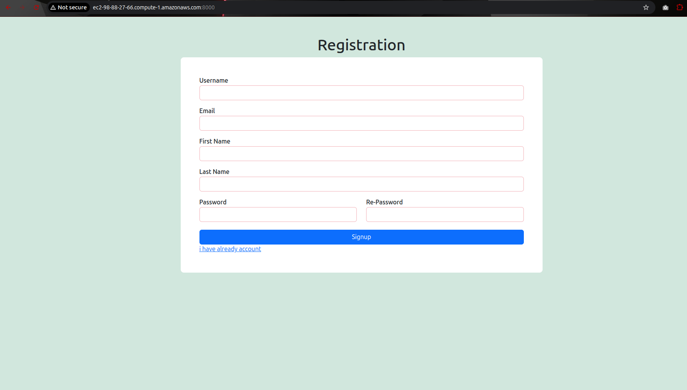

# Login_system
This project implements basic user signup, sign-in, and authentication functionality using Django.


## Task:
<ul>
<li>Create a Dockerfile for a simple web application (e.g. a Node.js or Python app)</li>
<li>Build the image using the Dockerfile and run the container</li>
<li>Verify that the application is working as expected by accessing it in a web browser</li>
<li>Push the image to a public or private repository (e.g. Docker Hub )</li>
</ul>

### Note:
Currently, we directly pushed the dockerfile into github, clone the repo into the EC2 and build the images at EC2 instance. 

```html
ubuntu@ip-172-31-21-47:~/container/Login_system$ ls
Dockerfile  README.md  registration_system  requirements.txt
ubuntu@ip-172-31-21-47:~/container/Login_system$ 
```
#### Dockerfile:
```Dockerfile
ubuntu@ip-172-31-21-47:~/container/Login_system$ cat Dockerfile 
FROM python:3.9

WORKDIR /app/registration_system

COPY . /app

RUN pip install -r /app/requirements.txt

EXPOSE 8000

CMD ["python", "manage.py", "runserver", "0.0.0.0:8000"]
ubuntu@ip-172-31-21-47:~/container/Login_system$ 
```
## Install Docker:

<ol>
<li> Update system packages:
<b><i>sudo apt update && sudo apt upgrade -y</i></b>
</li>
<li> Install required packages:
<b><i>sudo apt install -y ca-certificates curl gnupg
</i></b>
</li>

<li> Add Docker’s official GPG key:
<b><i>sudo install -m 0755 -d /etc/apt/keyrings
curl -fsSL https://download.docker.com/linux/ubuntu/gpg | \
sudo gpg --dearmor -o /etc/apt/keyrings/docker.gpg
sudo chmod a+r /etc/apt/keyrings/docker.gpg

</i></b>
</li>


<li> Add Docker repository:
<b><i>echo \
"deb [arch=$(dpkg --print-architecture) \
signed-by=/etc/apt/keyrings/docker.gpg] \
https://download.docker.com/linux/ubuntu \
$(lsb_release -cs) stable" | \
sudo tee /etc/apt/sources.list.d/docker.list > /dev/null

</i></b>
</li>

<li> Install Docker Engine:
<b><i>sudo apt update
sudo apt install -y docker-ce docker-ce-cli containerd.io

</i></b>
</li>

<li> Install Docker Engine:
<b><i>sudo apt update </br>
sudo apt install -y docker-ce docker-ce-cli containerd.io

</i></b>
</li>

<li> Verify Docker installation:
<b><i>docker --version
</i></b>
</li>

<li> Test Docker:
<b><i>sudo docker run hello-world
</i></b>
</li>

<li> Run Docker without sudo (IMPORTANT):
<b><i>sudo usermod -aG docker ubuntu
</i></b>
</li>
</ol>

```html
ubuntu@ip-172-31-21-47:~/container/Login_system$ sudo apt install -y ca-certificates curl gnupg
Reading package lists... Done
Building dependency tree... Done
Reading state information... Done
ca-certificates is already the newest version (20240203).
ca-certificates set to manually installed.
curl is already the newest version (8.5.0-2ubuntu10.6).
curl set to manually installed.
gnupg is already the newest version (2.4.4-2ubuntu17.4).
gnupg set to manually installed.
0 upgraded, 0 newly installed, 0 to remove and 2 not upgraded.
ubuntu@ip-172-31-21-47:~/container/Login_system$ sudo install -m 0755 -d /etc/apt/keyrings
curl -fsSL https://download.docker.com/linux/ubuntu/gpg | \
sudo gpg --dearmor -o /etc/apt/keyrings/docker.gpg
sudo chmod a+r /etc/apt/keyrings/docker.gpg
ubuntu@ip-172-31-21-47:~/container/Login_system$ echo \
"deb [arch=$(dpkg --print-architecture) \
signed-by=/etc/apt/keyrings/docker.gpg] \
https://download.docker.com/linux/ubuntu \
$(lsb_release -cs) stable" | \
sudo tee /etc/apt/sources.list.d/docker.list > /dev/null
ubuntu@ip-172-31-21-47:~/container/Login_system$ sudo apt update
Hit:1 http://us-east-1.ec2.archive.ubuntu.com/ubuntu noble InRelease
Hit:2 http://us-east-1.ec2.archive.ubuntu.com/ubuntu noble-updates InRelease             
Hit:3 http://us-east-1.ec2.archive.ubuntu.com/ubuntu noble-backports InRelease           
Hit:4 http://security.ubuntu.com/ubuntu noble-security InRelease                         
Get:5 https://download.docker.com/linux/ubuntu noble InRelease [48.5 kB]  
Get:6 https://download.docker.com/linux/ubuntu noble/stable amd64 Packages [43.3 kB]
Fetched 91.8 kB in 0s (214 kB/s)    
Reading package lists... Done
Building dependency tree... Done
Reading state information... Done
2 packages can be upgraded. Run 'apt list --upgradable' to see them.
ubuntu@ip-172-31-21-47:~/container/Login_system$ sudo apt install -y docker-ce docker-ce-cli containerd.io
Reading package lists... Done
Building dependency tree... Done
Reading state information... Done
The following additional packages will be installed:
  docker-buildx-plugin docker-ce-rootless-extras docker-compose-plugin libslirp0 pigz slirp4netns
Suggested packages:
  cgroupfs-mount | cgroup-lite docker-model-plugin
The following NEW packages will be installed:
  containerd.io docker-buildx-plugin docker-ce docker-ce-cli docker-ce-rootless-extras docker-compose-plugin libslirp0 pigz slirp4netns
0 upgraded, 9 newly installed, 0 to remove and 2 not upgraded.
Need to get 96.7 MB of archives.
After this operation, 391 MB of additional disk space will be used.
Get:1 http://us-east-1.ec2.archive.ubuntu.com/ubuntu noble/universe amd64 pigz amd64 2.8-1 [65.6 kB]
Get:2 http://us-east-1.ec2.archive.ubuntu.com/ubuntu noble/main amd64 libslirp0 amd64 4.7.0-1ubuntu3 [63.8 kB]
Get:3 http://us-east-1.ec2.archive.ubuntu.com/ubuntu noble/universe amd64 slirp4netns amd64 1.2.1-1build2 [34.9 kB]
Get:4 https://download.docker.com/linux/ubuntu noble/stable amd64 containerd.io amd64 2.2.1-1~ubuntu.24.04~noble [23.4 MB]
Get:5 https://download.docker.com/linux/ubuntu noble/stable amd64 docker-ce-cli amd64 5:29.2.0-1~ubuntu.24.04~noble [16.3 MB]
Get:6 https://download.docker.com/linux/ubuntu noble/stable amd64 docker-ce amd64 5:29.2.0-1~ubuntu.24.04~noble [22.5 MB]
Get:7 https://download.docker.com/linux/ubuntu noble/stable amd64 docker-buildx-plugin amd64 0.31.1-1~ubuntu.24.04~noble [20.3 MB]
Get:8 https://download.docker.com/linux/ubuntu noble/stable amd64 docker-ce-rootless-extras amd64 5:29.2.0-1~ubuntu.24.04~noble [6387 kB]
Get:9 https://download.docker.com/linux/ubuntu noble/stable amd64 docker-compose-plugin amd64 5.0.2-1~ubuntu.24.04~noble [7721 kB]
Fetched 96.7 MB in 1s (90.8 MB/s)               
Selecting previously unselected package containerd.io.
(Reading database ... 79210 files and directories currently installed.)
Preparing to unpack .../0-containerd.io_2.2.1-1~ubuntu.24.04~noble_amd64.deb ...
Unpacking containerd.io (2.2.1-1~ubuntu.24.04~noble) ...
Selecting previously unselected package docker-ce-cli.
Preparing to unpack .../1-docker-ce-cli_5%3a29.2.0-1~ubuntu.24.04~noble_amd64.deb ...
Unpacking docker-ce-cli (5:29.2.0-1~ubuntu.24.04~noble) ...
Selecting previously unselected package docker-ce.
Preparing to unpack .../2-docker-ce_5%3a29.2.0-1~ubuntu.24.04~noble_amd64.deb ...
Unpacking docker-ce (5:29.2.0-1~ubuntu.24.04~noble) ...
Selecting previously unselected package pigz.
Preparing to unpack .../3-pigz_2.8-1_amd64.deb ...
Unpacking pigz (2.8-1) ...
Selecting previously unselected package docker-buildx-plugin.
Preparing to unpack .../4-docker-buildx-plugin_0.31.1-1~ubuntu.24.04~noble_amd64.deb ...
Unpacking docker-buildx-plugin (0.31.1-1~ubuntu.24.04~noble) ...
Selecting previously unselected package docker-ce-rootless-extras.
Preparing to unpack .../5-docker-ce-rootless-extras_5%3a29.2.0-1~ubuntu.24.04~noble_amd64.deb ...
Unpacking docker-ce-rootless-extras (5:29.2.0-1~ubuntu.24.04~noble) ...
Selecting previously unselected package docker-compose-plugin.
Preparing to unpack .../6-docker-compose-plugin_5.0.2-1~ubuntu.24.04~noble_amd64.deb ...
Unpacking docker-compose-plugin (5.0.2-1~ubuntu.24.04~noble) ...
Selecting previously unselected package libslirp0:amd64.
Preparing to unpack .../7-libslirp0_4.7.0-1ubuntu3_amd64.deb ...
Unpacking libslirp0:amd64 (4.7.0-1ubuntu3) ...
Selecting previously unselected package slirp4netns.
Preparing to unpack .../8-slirp4netns_1.2.1-1build2_amd64.deb ...
Unpacking slirp4netns (1.2.1-1build2) ...
Setting up docker-buildx-plugin (0.31.1-1~ubuntu.24.04~noble) ...
Setting up containerd.io (2.2.1-1~ubuntu.24.04~noble) ...
Created symlink /etc/systemd/system/multi-user.target.wants/containerd.service → /usr/lib/systemd/system/containerd.service.
Setting up docker-compose-plugin (5.0.2-1~ubuntu.24.04~noble) ...
Setting up docker-ce-cli (5:29.2.0-1~ubuntu.24.04~noble) ...
Setting up libslirp0:amd64 (4.7.0-1ubuntu3) ...
Setting up pigz (2.8-1) ...
Setting up docker-ce-rootless-extras (5:29.2.0-1~ubuntu.24.04~noble) ...
Setting up slirp4netns (1.2.1-1build2) ...
Setting up docker-ce (5:29.2.0-1~ubuntu.24.04~noble) ...
Created symlink /etc/systemd/system/multi-user.target.wants/docker.service → /usr/lib/systemd/system/docker.service.
Created symlink /etc/systemd/system/sockets.target.wants/docker.socket → /usr/lib/systemd/system/docker.socket.
Processing triggers for man-db (2.12.0-4build2) ...
Processing triggers for libc-bin (2.39-0ubuntu8.6) ...
Scanning processes...                                                                                                                                                                   
Scanning candidates...                                                                                                                                                                  
Scanning linux images...                                                                                                                                                                

Running kernel seems to be up-to-date.

Restarting services...

Service restarts being deferred:
 /etc/needrestart/restart.d/dbus.service
 systemctl restart getty@tty1.service
 systemctl restart networkd-dispatcher.service
 systemctl restart serial-getty@ttyS0.service
 systemctl restart systemd-logind.service
 systemctl restart unattended-upgrades.service

No containers need to be restarted.

User sessions running outdated binaries:
 ubuntu @ session #1: sshd[909]
 ubuntu @ user manager service: systemd[928]

No VM guests are running outdated hypervisor (qemu) binaries on this host.
ubuntu@ip-172-31-21-47:~/container/Login_system$ docker --version
Docker version 29.2.0, build 0b9d198
ubuntu@ip-172-31-21-47:~/container/Login_system$ sudo docker run hello-world
Unable to find image 'hello-world:latest' locally
latest: Pulling from library/hello-world
17eec7bbc9d7: Pull complete 
ea52d2000f90: Download complete 
Digest: sha256:05813aedc15fb7b4d732e1be879d3252c1c9c25d885824f6295cab4538cb85cd
Status: Downloaded newer image for hello-world:latest

Hello from Docker!
This message shows that your installation appears to be working correctly.

To generate this message, Docker took the following steps:
 1. The Docker client contacted the Docker daemon.
 2. The Docker daemon pulled the "hello-world" image from the Docker Hub.
    (amd64)
 3. The Docker daemon created a new container from that image which runs the
    executable that produces the output you are currently reading.
 4. The Docker daemon streamed that output to the Docker client, which sent it
    to your terminal.

To try something more ambitious, you can run an Ubuntu container with:
 $ docker run -it ubuntu bash

Share images, automate workflows, and more with a free Docker ID:
 https://hub.docker.com/

For more examples and ideas, visit:
 https://docs.docker.com/get-started/

ubuntu@ip-172-31-21-47:~/container/Login_system$ sudo usermod -aG docker ubuntu

```

###  Build an Image using Dockerfile:
<b><i>To build an image using Dockerfile, Go to the directory that has your Dockerfile and run the following command</i></b>
```html
docker build -t <image-name> 
```

```python
ubuntu@ip-172-31-21-47:~/container/Login_system$ docker build -t login-system-img:v1 .
```
```bash
ubuntu@ip-172-31-21-47:~/container/Login_system$ docker build -t login-system-img:v1 .
[+] Building 26.6s (9/9) FINISHED                                                                                                                                        docker:default
 => [internal] load build definition from Dockerfile                                                                                                                               0.0s
 => => transferring dockerfile: 215B                                                                                                                                               0.0s
 => [internal] load metadata for docker.io/library/python:3.9                                                                                                                      0.3s
 => [internal] load .dockerignore                                                                                                                                                  0.0s
 => => transferring context: 80B                                                                                                                                                   0.0s
 => [1/4] FROM docker.io/library/python:3.9@sha256:da5aee29682d12a6649f51c8d6f15b87deb3e6c524b923c41d0cb3304d07c913                                                               15.6s
 => => resolve docker.io/library/python:3.9@sha256:da5aee29682d12a6649f51c8d6f15b87deb3e6c524b923c41d0cb3304d07c913                                                                0.0s
 => => sha256:91c91c91f1d23f4edf4280a8fe935f14340fec43a7a3576149a7cffcf70c2f9b 250B / 250B                                                                                         0.1s
 => => sha256:c9723aa529b03c40e66d0aee927a410b4719528ab865af6e0bac1b7c9b10829e 20.37MB / 20.37MB                                                                                   0.5s
 => => sha256:081ccf923272c30c6072c6ff1617d9072e03ab2a90a431951d325d45e296962b 6.10MB / 6.10MB                                                                                     0.2s
 => => sha256:79d5bd8a8d262418bf22e705535ce38c6789dc72e319d76b30aafa5c331b6924 235.93MB / 235.93MB                                                                                 3.1s
 => => sha256:89d573bf42b377ce6a5a0451c15388849686fa4058efd68999f3b014daeb5b55 25.62MB / 25.62MB                                                                                   0.7s
 => => sha256:26dfe2fac1c486e9aaf41d1028ed30be2c442aa84af44462bc7bac8c148ffb13 67.78MB / 67.78MB                                                                                   1.5s
 => => sha256:795dbedde24d2c72dafd2b71fe36643552e56859c0e29cdb095ed54b825fbaa2 49.28MB / 49.28MB                                                                                   1.2s
 => => extracting sha256:795dbedde24d2c72dafd2b71fe36643552e56859c0e29cdb095ed54b825fbaa2                                                                                          2.0s
 => => extracting sha256:89d573bf42b377ce6a5a0451c15388849686fa4058efd68999f3b014daeb5b55                                                                                          0.7s
 => => extracting sha256:26dfe2fac1c486e9aaf41d1028ed30be2c442aa84af44462bc7bac8c148ffb13                                                                                          2.4s
 => => extracting sha256:79d5bd8a8d262418bf22e705535ce38c6789dc72e319d76b30aafa5c331b6924                                                                                          7.4s
 => => extracting sha256:081ccf923272c30c6072c6ff1617d9072e03ab2a90a431951d325d45e296962b                                                                                          0.3s
 => => extracting sha256:c9723aa529b03c40e66d0aee927a410b4719528ab865af6e0bac1b7c9b10829e                                                                                          0.8s
 => => extracting sha256:91c91c91f1d23f4edf4280a8fe935f14340fec43a7a3576149a7cffcf70c2f9b                                                                                          0.0s
 => [internal] load build context                                                                                                                                                  0.1s
 => => transferring context: 162.69kB                                                                                                                                              0.0s
 => [2/4] WORKDIR /app/registration_system                                                                                                                                         0.1s
 => [3/4] COPY . /app                                                                                                                                                              0.1s
 => [4/4] RUN pip install -r /app/requirements.txt                                                                                                                                 6.0s
 => exporting to image                                                                                                                                                             4.3s 
 => => exporting layers                                                                                                                                                            2.4s 
 => => exporting manifest sha256:17df1101b6d341db6f5757e90dbdaf7a483ae633df3eeb1a337ef5a2a141dc1a                                                                                  0.0s 
 => => exporting config sha256:e3ccb73f1958e1487068f51f95e9abe8cf0b66e63cfcf7256edd84c69886ebd9                                                                                    0.0s 
 => => exporting attestation manifest sha256:b03d41c8d60423f9c4364ccdc14075c752a699cd935756b60993fbc1320d8e41                                                                      0.0s 
 => => exporting manifest list sha256:b60ccdcd4f69648bab128c4f8639e4aa7dd7d25f62d803345d2c2feeaf9185c5                                                                             0.0s 
 => => naming to docker.io/library/login-system-img:v1                                                                                                                             0.0s
 => => unpacking to docker.io/library/login-system-img:v1                                                                                                                          1.7s
ubuntu@ip-172-31-21-47:~/container/Login_system$ 

```
#### By using docker images command we can see the list of images.

```bash
ubuntu@ip-172-31-21-47:~/container/Login_system$ docker images
                                                                                                                                                                    i Info →   U  In Use
IMAGE                 ID             DISK USAGE   CONTENT SIZE   EXTRA
hello-world:latest    05813aedc15f       25.9kB         9.52kB    U   
login-system-img:v1   b60ccdcd4f69       1.66GB          422MB        
ubuntu@ip-172-31-21-47:~/container/Login_system$ 
```

### Run the image to create a container:

```html
docker run -d - -name <container-name> -p 8000:8000 <image-name>
```

```bash
ubuntu@ip-172-31-21-47:~/container/Login_system$ docker run -d --name login_system -p 8000:8000 login-system-img:v1 
7117af03e04eb1573902701321a328aa6009e0098979d616f7769c779318c610
ubuntu@ip-172-31-21-47:~/container/Login_system$ docker ps
CONTAINER ID   IMAGE                 COMMAND                  CREATED         STATUS         PORTS                                         NAMES
7117af03e04e   login-system-img:v1   "python manage.py ru…"   6 seconds ago   Up 5 seconds   0.0.0.0:8000->8000/tcp, [::]:8000->8000/tcp   login_system
ubuntu@ip-172-31-21-47:~/container/Login_system$
```

```bash
ubuntu@ip-172-31-21-47:~/container/Login_system$ docker ps
CONTAINER ID   IMAGE                 COMMAND                  CREATED         STATUS         PORTS                                         NAMES
7117af03e04e   login-system-img:v1   "python manage.py ru…"   6 seconds ago   Up 5 seconds   0.0.0.0:8000->8000/tcp, [::]:8000->8000/tcp   login_system
ubuntu@ip-172-31-21-47:~/container/Login_system$ docker exec -it login_system bash
root@7117af03e04e:/app/registration_system# ls
db.sqlite3  manage.py  reg_app	registration_system  templates
root@7117af03e04e:/app/registration_system# cd registration_system/

```

